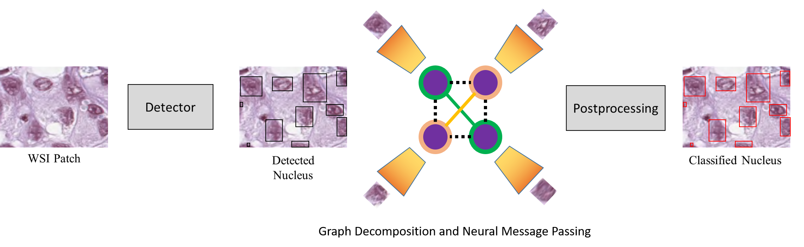
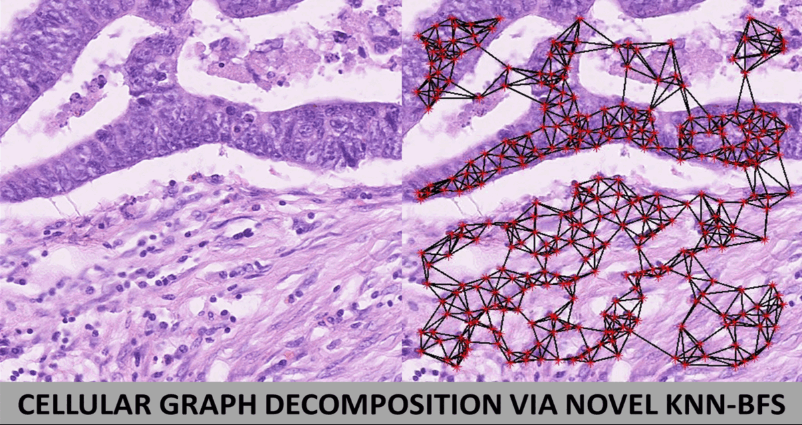

# Learning to Recognize Cellular Communities in Histopathological Landscape

This the official implementation of our paper, titled, *Learning to Recognize Cellular Communities in Histopathological Landscape*. In this codebase, we couple neural message solver with the nuclei graph decomposition network in order to effectively recognize cellular communities within the CRC whole slide images. The block diagram of the complete framework is illusrated below: 



## Requirements
This codebase is developed and fully tested on Anaconda with **Python 3.6.10**, **Pytorch 1.5.0** with **CUDA 10.1** on **Ubuntu v20.04**. Hence, we recommend the utilization of the same execution environment in order to avoid any setup errors. Also, please note that we do not support Windows OS. 

The code flow is currently dependent on two virtual environments, i.e., `cellGraph.yaml` and `metrics.yaml`. `cellGraph.yaml` is to be used for training and testing the proposed framework. Moreover, in order to fairly compare our work with state-of-the-art, `metrics.yaml` environment has to be used, as it computes the crc metrics originally developed by the [HoVerNet](https://github.com/vqdang/hover_net) devs. In future, we will merge both of these two environments. But, for now, we recommend their independent usage just to avoid libs incompatibility.   

## Setup

1. Import the 'cellGraph.yaml' and install the related code dependencies as:
    1. `conda env create -f cellGraph.yaml`
    2. `conda activate cellGraph`
    3. `pip install -e tracking_wo_bnw`
    4. `pip install -e .`

2. Import the 'metrics.yaml' and infer the related libraries from the requirement.txt file:
   1. `conda env create -f metrics.yaml`
    
3. Download the CRC datasets from their respective link. Please note that all of these datasets have to be tailored in the MOT format for their proper usage. For this purpose, we provide the conversion scripts as discussed in detail within the `preprocessing` section. Moreover, the desired converted dataset must be placed within the `data` folder within the project's root directory.

4. Create two more folders (`output`, `mot_neural_solver/output`) in the project's root directory to save proposed framework's output. Their hierarchy are:

```
├── output
│   ├── experiments
│   │   └── time_date_train_w_default_config
│   │   └── time_date_evaluation
│   ├── trained_models
│   |   └── frcnn
│   |   └── graph_nets
│   |   └── reid

```

```
├── mot_neural_solver
│   ├── output
│   |   ├── crchisto
│   |   │   └── true
│   |   │   └── pred
│   |   ├── consep
│   |   │   └── true
│   |   │   └── pred
│   |   ├── pannuke
│   |   │   └── true
│   |   │   └── pred
│   |   ├── lizard
│   |   │   └── true
│   |   │   └── pred
│   |   ├── graphs
│   |   │   └── MOT17-01-FRCNN.npy

```

## Preprocessing
To use each CRC dataset with this codebase, it has to be converted in the MOT-17 format. The MOT-17 format requires two sub-directories (`MOT17Dets` and `MOT17Labels`) in which each WSI (within the candidate dataset) has to be replicated into multiple frames (depending on the total number of nuclei classes). Moreover, each nuclei is connected to its adjacent pair in the breadth first search manner to yield the time-aware sequence graph representation. For this purpose, we first provide the `generateDataset.m` script, which converts the desired dataset to MOT-17 format. Please note that this script has to be tuned as per each dataset structure accordingly. Then, we provide `detector2mot.m` script which changes each detection (recorded in the JSON format) from each preprocessing backbone to mot structure. There is also another script (i.e., `datasetConverter.m`) which can perform these two tasks simultaneously. Apart from this, currently, we provide support for the two detectors, i.e., [Faster R-CNN](https://github.com/facebookresearch/detectron2) and [HoVer-Net](https://github.com/vqdang/hover_net).  

For convenience, we also provide mirrors for the converted datasets. These mirrors can directly take you to the training and testing phase. The mirrors for the CRCHisto, CoNSeP and PanNuke are given below. However, if you need mirror for Lizard dataset, then please contact us. We can give you temporary link to download it as its physical size is over 150GB.
   1. [CRCHisto](https://drive.google.com/file/d/1H9J5vGE-e-7UgravOMiAYjZzRQH4vk5l/view?usp=sharing)
   2. [ConSeP](https://drive.google.com/file/d/14x8howsmet6xRvEC7hPeAe08nx3Dtaon/view?usp=sharing)
   3. [PanNuke](https://drive.google.com/file/d/1NoraFIdse-xEkGoqnL3BVcEu6-E6IcJO/view?usp=sharing)

## Training
1. After converting and placing the desired dataset in the `data` folder. Please make sure that the following dataset configurations are updated:
   1. 'dataset' parameter in `tracking_cfg.yaml`
   2. 'MOV_CAM_DICT' in `MOTCha_loader.py`
   3. 'sequence_numbers' in `seq_processor.py`
   4. 'frame_numbers' in `splits.py`

2. Train the proposed framework by running:
```
python scripts/train.py 
```
By default, HoVer-Net is chosen as a backbone detector. If you want to use Faster R-CNN, then please run:
```
python scripts/train.py with prepr_w_tracktor=False
```

The trained models (for each dataset) can also be downloaded through:
```
bash scripts/setup/download_models_crchisto.sh
bash scripts/setup/download_models_consep.sh
bash scripts/setup/download_models_pannuke.sh
bash scripts/setup/download_models_lizard.sh
```

## Inference
1. In order to evaluate the proposed framework on the test dataset, please run:
```
python scripts/evaluate.py 
```
or
```
python scripts/evaluate.py with prepr_w_tracktor=False
```
2. To compute performance metrics, please activate `metrics.yaml` in a seperate shell, and run:
```
python compute_stats.py --mode=type --pred_dir='pred_dir' --true_dir='true_dir'
```

## Results
The proposed framework is evaluated on four CRC datasets which are publicly released by Tissue Image Analysis (TIA) lab, University of Warwick, UK. Moreover, the nucleus classification performance of the proposed framework (backboned through HoVer-Net) is thoroughly compared with state-of-the-art frameworks on all four datasets, as shown below:

CRCHisto:
    
| Method   | F<sub>d</sub> | F<sub>e</sub> | F<sub>i</sub> | F<sub>f</sub> | F<sub>o</sub> |
| -----------|----------------| ---------------|----------------|----------------|----------------|
| Proposed | 0.688          | 0.572          | 0.571          | 0.527          | 0.222          |
| SC-CNN | 0.664          | 0.246          | 0.111          | 0.126          | 0.000          |
| DIST | 0.616          | 0.464          | 0.514          | 0.275          | 0.000          |
| Micro-Net | 0.638          | 0.422          | 0.518          | 0.249          | 0.059          |
| Mask R-CNN | 0.639          | 0.503          | 0.537          | 0.294          | 0.077          |
| HoVer-Net | 0.688          | 0.486          | 0.573          | 0.302          | 0.178          |


CoNSeP: 
| Method   | F<sub>d</sub> | F<sub>e</sub> | F<sub>i</sub> | F<sub>f</sub> | F<sub>o</sub> |
| -----------|----------------| ---------------|----------------|----------------|----------------|
| Proposed | 0.748          | 0.739          | 0.659          | 0.589          | 0.564          |
| SC-CNN | 0.608          | 0.306          | 0.193          | 0.175          | 0.000          |
| DIST | 0.712          | 0.617          | 0.534          | 0.505          | 0.000          |
| Micro-Net | 0.743          | 0.615          | 0.592          | 0.532          | 0.117          |
| Mask R-CNN | 0.692          | 0.595          | 0.590          | 0.520          | 0.098          |
| HoVer-Net | 0.748          | 0.635          | 0.631          | 0.566          | 0.426          |

PanNuke: 
| Method   | F<sub>d</sub> |F<sub>n</sub> | F<sub>i</sub> | F<sub>c</sub> | F<sub>de</sub> | F<sub>e</sub> |
| -----------|-----------|----------------| ---------------|----------------|----------------|----------------|
| Proposed |0.799  | 0.686           | 0.589          | 0.563          | 0.155          | 0.585          |
| Mask R-CNN |0.720 | 0.590          | 0.500          | 0.420          | 0.220          | 0.520          |
| Faster R-CNN | 0.732 |0.501          | 0.418          | 0.491          | 0.274          | 0.390          |
| HoVer-Net | 0.799 |0.648          | 0.525          | 0.559          | 0.142          | 0.513          |

Lizard: 
| Method   | F<sub>d</sub> |F<sub>epi</sub> | F<sub>l</sub> | F<sub>p</sub> | F<sub>n</sub> | F<sub>e</sub> | F<sub>c</sub> |
| -----------|-----------|----------------| ---------------|----------------|----------------|----------------|----------------|
| Proposed |0.526  |0.463            |0.477           | 0.493          | 0.568          | 0.352          | 0.450          |
| Faster R-CNN |0.487 | 0.433          | 0.413          | 0.289          | 0.250          | 0.075          | 0.396          |
| HoVer-Net | 0.526 |0.354          | 0.441          | 0.339          | 0.548          | 0.248          | 0.436          |

<!--- | Prop + FRCNN | 0.487 |0.480          | 0.438          | 0.358          | 0.317          | 0.135          | 0.449          | -->

Apart from this, some of the qualitative examples of the proposed framework (across all four datasets) is shown below:

<p float="left">
  
</p>


## Acknowledgement
We would like to thank Guillem Brasó and his team for their excellent contribution towards developing [time-aware neural solver for multi-object tracking](https://github.com/dvl-tum/mot_neural_solver). Apart from this, we would like to thank Simon Graham and his team for their excellent work in releasing [HoVer-Net](https://github.com/vqdang/hover_net) and the original implementation of their performance metrics related to CRC nucleus segmentation and classification. Our codebase is extensively derived from these two repos, and as a token of our appreciation, we have acknowledged and cited their works in our manuscript.

## Citation
Currently the paper related to this work is under review. Therefore, until it is published, you **MUST** cite the following paper if you use this codebase (or any part of it) in your research:
```
@article{Hassan2021Cancer,
  title   = {A Dilated Residual Hierarchically Fashioned Segmentation Framework for Extracting Gleason Tissues and Grading Prostate Cancer from Whole Slide Images},
  author  = {Taimur Hassan and Bilal Hassan and Ayman El-Baz and Naoufel Werghi},
  note = {16th IEEE Sensors Applications Symposium (SAS), 2021}
}
```
## Contact
In case of any query, please feel free to contact us at taimur.hassan@ku.ac.ae


