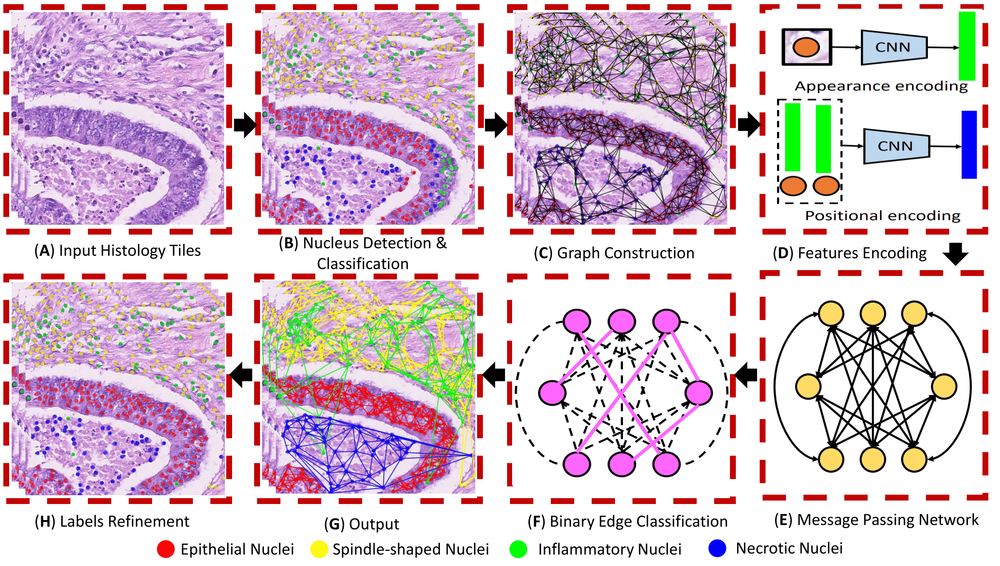

# Nucleus Classification in Histology Images Using Message Passing Network

This repo reflects the implementation of the paper, titled, *Learning to Detect Nuclear Communities in Histology Images Using Message Passing Network*. In this codebase, the neural solver is coupled with the nuclei graph decomposition network in order to effectively recognize cellular communities within the CRC whole slide images. The block diagram of the complete framework is illusrated below: 



System Diagram of the proposed algorithm for nucleus classification in histology images.

## Requirements
This codebase is developed and fully tested on Anaconda with **Python 3.6.10**, **Pytorch 1.5.0** with **CUDA 10.1** on **Ubuntu v20.04**. Hence, we recommend the utilization of the same execution environment in order to avoid any setup errors. Also, please note that we do not support Windows OS. 

The code flow is currently dependent on two virtual environments, i.e., `cellGraph.yaml` and `metrics.yaml`. `cellGraph.yaml` is to be used for training and testing the proposed framework. Moreover, in order to fairly compare our work with state-of-the-art, `metrics.yaml` environment has to be used, as it computes the crc metrics originally developed by the [HoVerNet](https://github.com/vqdang/hover_net) devs. In future, we will merge both of these two environments. But, for now, we recommend their independent usage just to avoid libs incompatibility.   

## Setup

1. Import the 'cellGraph.yaml' and install the related code dependencies as:
    1. `conda env create -f cellGraph.yaml`
    2. `conda activate cellGraph`

2. Import the 'metrics.yaml' and infer the related libraries from the 'requirement.txt' file:
   1. `conda env create -f metrics.yaml`
    
3. Download the CRC datasets from their respective link, convert the dataset using `datasetConverter.m` script. Place the converted dataset in the `data` folder within project's root directory.

4. Create an `output` folder within root directory to save proposed framework's output. 

## Preprocessing
To use each CRC dataset with this codebase, it has to be converted and each WSI (within the candidate dataset) has to be replicated into multiple frames (depending on the total number of nuclei classes). Also, each nuclei has to be connected to its adjacent pair in the breadth first search manner to yield the neighborhood-aware sequence graph representation. 

For convenience, we also provide mirrors for the converted datasets. These mirrors can directly take you to the training and testing phase. The mirrors for the CRCHisto, CoNSeP and PanNuke are given below. However, if you need mirror for Lizard dataset, then please contact us. We can give you temporary link to download it as its physical size is over 150GB.
   1. [CRCHisto](https://drive.google.com/file/d/1H9J5vGE-e-7UgravOMiAYjZzRQH4vk5l/view?usp=sharing)
   2. [ConSeP](https://drive.google.com/file/d/14x8howsmet6xRvEC7hPeAe08nx3Dtaon/view?usp=sharing)
   3. [PanNuke](https://drive.google.com/file/d/1NoraFIdse-xEkGoqnL3BVcEu6-E6IcJO/view?usp=sharing)

## Training
1. After converting and placing the desired dataset in the `data` folder. Please make sure that the following dataset configurations are updated:
   1. 'sequence_numbers' in `seq_processor.py`
   2. 'frame_numbers' in `splits.py`

2. Train the proposed framework by running:
```
python scripts/train.py 
```
By default, HoVer-Net is chosen as a backbone detector. If you want to use Faster R-CNN, then please run:
```
python scripts/train.py with prepr_w_tracktor=False
```

The trained models (for each dataset) can also be downloaded through:
```
bash scripts/setup/download_models_crchisto.sh
bash scripts/setup/download_models_consep.sh
bash scripts/setup/download_models_pannuke.sh
bash scripts/setup/download_models_lizard.sh
```

## Inference
1. In order to evaluate the proposed framework on the test dataset, please run:
```
python scripts/evaluate.py 
```
or
```
python scripts/evaluate.py with prepr_w_tracktor=False
```
2. To compute performance metrics, please activate `metrics.yaml` in a seperate shell, and run:
```
python compute_stats.py --mode=type --pred_dir='pred_dir' --true_dir='true_dir'
```

## Citation
If you use this codebase (or any part of it) in your research then you **MUST** cite the following paper:

```
@article{Hassan2022NCD,
  title   = {Learning to Detect Nuclear Communities in Histology Images Using Message Passing Network},
  author  = {Taimur Hassan and Sajid Javed and Talha Qaiser and Arif Mahmood and Naoufel Werghi and Nasir Rajpoot},
  note = {Under Review in Medical Image Analysis, 2022}
}
```

